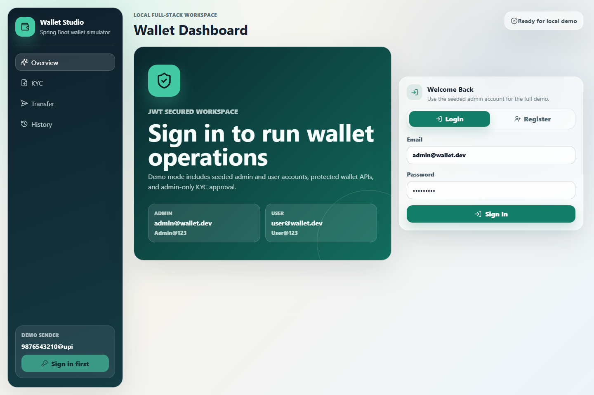

# Spring Boot Wallet Simulator

A personal Spring Boot learning project that models a small UPI-style wallet system. It focuses on KYC onboarding, wallet activation, simulated bank funding, peer-to-peer transfers, transaction history, and refund compensation when an external receiver bank fails.



## Why I Built This

This project is meant to practice backend concepts that matter in financial systems:

- Transaction boundaries and rollback behavior
- Pessimistic locking to reduce double-spend risk
- Wallet balance updates with a transaction ledger
- KYC upload and admin approval workflow
- Frontend-friendly REST response contracts
- Test isolation with an in-memory database
- Environment-based configuration instead of hardcoded secrets

## Tech Stack

- Java 17
- Spring Boot
- Spring Web MVC
- Spring Security with JWT
- Spring Data JPA and Hibernate
- MySQL for local runtime
- H2 for tests
- Maven
- Lombok

## API Overview

All successful responses use this shape:

```json
{
  "success": true,
  "message": "Wallet found",
  "data": {},
  "timestamp": "2026-06-10T02:25:00"
}
```

| Method | Endpoint | Purpose |
| --- | --- | --- |
| POST | `/api/v1/auth/register` | Create a user account and return a JWT. |
| POST | `/api/v1/auth/login` | Sign in and return a JWT. |
| POST | `/api/v1/wallet/kyc/upload` | Submit KYC metadata and a document file. |
| POST | `/api/v1/admin/kyc/{kycId}/approve` | Approve KYC and activate a wallet. |
| POST | `/api/v1/wallet/fund` | Add simulated bank funds to a wallet. |
| POST | `/api/v1/wallet/transfer` | Transfer funds between two UPI IDs. |
| POST | `/api/v1/wallet/simulate-failure` | Debit, simulate receiver-bank failure, then refund. |
| GET | `/api/v1/wallet/{upiId}` | Fetch wallet balance and profile summary. |
| GET | `/api/v1/wallet/{upiId}/transactions` | Fetch recent wallet ledger entries. |
| GET | `/api-docs` | OpenAPI contract for frontend development. |

## Example Requests

Fund wallet:

```json
{
  "upiId": "9876543210@upi",
  "amount": 500.00,
  "bankReferenceId": "BANK-REF-1001"
}
```

Transfer funds:

```json
{
  "senderUpiId": "9876543210@upi",
  "receiverUpiId": "9123456780@upi",
  "amount": 125.50
}
```

## Configuration

The app reads local settings from environment variables:

| Variable | Default |
| --- | --- |
| `DB_URL` | `jdbc:mysql://localhost:3306/wallet_db` |
| `DB_USERNAME` | `root` |
| `DB_PASSWORD` | empty |
| `KYC_UPLOAD_DIRECTORY` | `uploads/kyc-documents` |
| `CORS_ALLOWED_ORIGINS` | `http://localhost:5173,http://127.0.0.1:5173,http://localhost:3000,http://127.0.0.1:3000` |
| `JWT_SECRET` | `wallet-simulator-local-dev-secret-key` |
| `JWT_EXPIRATION_SECONDS` | `86400` |

PowerShell example:

```powershell
$env:DB_URL="jdbc:mysql://localhost:3306/wallet_db"
$env:DB_USERNAME="root"
$env:DB_PASSWORD="your-local-password"
$env:KYC_UPLOAD_DIRECTORY="uploads/kyc-documents"
$env:CORS_ALLOWED_ORIGINS="http://localhost:5173,http://127.0.0.1:5173,http://localhost:3000,http://127.0.0.1:3000"
$env:JWT_SECRET="replace-this-with-a-long-local-secret"
```

## Run Locally

### Backend

For a quick demo, run the backend with the in-memory dev database:

```powershell
.\mvnw.cmd spring-boot:run "-Dspring-boot.run.profiles=dev"
```

For MySQL runtime, create the database first:

```sql
CREATE DATABASE wallet_db;
```

Then run the app:

```powershell
.\mvnw.cmd spring-boot:run
```

The dev profile seeds two demo wallets:

```text
9876543210@upi
9123456780@upi
```

It also seeds two demo accounts:

```text
admin@wallet.dev / Admin@123
user@wallet.dev / User@123
```

Open the API contract:

```text
http://localhost:8080/api-docs
```

Run tests:

```powershell
.\mvnw.cmd test
```

### Frontend

Run the frontend:

```powershell
cd frontend
npm install
npm run dev
```

The frontend runs on:

```text
http://localhost:5173
```

Build the frontend:

```powershell
cd frontend
npm run build
```

The deployed frontend proxies `/api` requests to the Render backend through Vercel:

```text
https://spring-boot-wallet-simulator.onrender.com
```

Set `VITE_API_BASE_URL` to override the backend URL for another environment.

## Deploy Backend on Render

Create a Render **Web Service** from this repository and select the **Docker** runtime. The included `Dockerfile` builds and runs the Spring Boot backend.

For a simple portfolio demo, add these environment variables:

```text
SPRING_PROFILES_ACTIVE=dev
JWT_SECRET=replace-with-a-long-random-secret
CORS_ALLOWED_ORIGINS=https://your-frontend.vercel.app
```

Use `/api-docs` as the health check path. The dev profile uses an in-memory H2 database, so demo data resets whenever the service restarts.

## Demo Flow

The React frontend includes these screens:

- Overview dashboard with wallet KPIs and demo flow
- KYC submission
- Admin KYC approval
- Wallet dashboard
- Fund wallet
- Send money
- Transaction history
- Failure/refund simulator

1. Start the backend with the `dev` profile.
2. Open the frontend at `http://localhost:5173`.
3. Sign in with `admin@wallet.dev / Admin@123`.
4. Load the seeded wallet `9876543210@upi`.
5. Fund the wallet, send money, approve KYC, and view ledger history.

## Publishing Notes

Runtime uploads and local `.env` files are ignored by Git. Do not commit generated KYC documents, real IDs, passwords, tokens, or database dumps.

This project has been refactored as a personal learning project. Before making it public, make sure the implementation, frontend, tests, documentation, and commit history reflect your own work.
